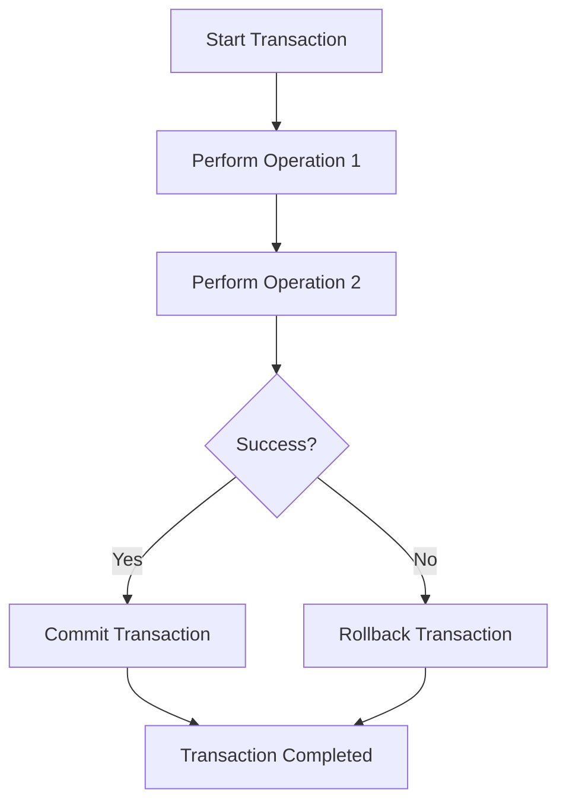
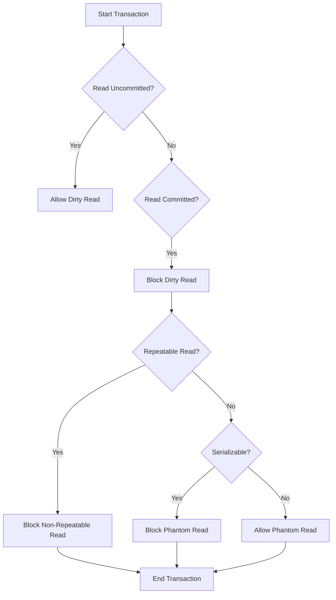

# Caching

## Introduction to Caching
Caching allows you to efficiently reuse previously retrieved or computed data. In computing, a cache is a high-speed data storage layer that stores a subset of data, typically transient in nature, so that future requests for that data are served faster than accessing the data’s primary storage location.

## Caching in Multiple Layers

### 1. DNS: Domain to IP Resolution
When a user requests a website, their system or browser queries DNS servers to translate the domain name into an IP address. Caching these results ensures that repeated requests for the same domain are resolved faster, reducing repetitive network lookups and improving overall browsing efficiency. This is especially helpful in reducing latency and improving user experience by avoiding delays in domain resolution.

### 2. Web: Accelerate Retrieval of Web Content
Web caching stores copies of frequently accessed web pages, images, and other content. When users request this content, it is quickly delivered from the cache without needing to fetch it from the origin server. This reduces load times, server strain, bandwidth usage, and server costs. Typically implemented using a CDN, web caching improves the responsiveness of web applications, ensuring a smoother and faster user experience.

### 3. Application: Accelerate Application Performance
Application caching improves performance by storing frequently accessed data and computational results closer to the application. This minimizes the need for repeated database queries or complex calculations, often utilizing tools like **Memcached** or **Redis**. This type of caching is particularly valuable for high-traffic applications, as it enhances scalability and reduces backend load.

## Benefits of Caching
- **Faster and Less Expensive Data Access:** Accessing cached data is faster than fetching it from primary storage like a database.
- **Improved Application Performance:** Reduces the time to deliver responses and enhances the user experience.
- **Reduced Backend Load:** Decreases the number of costly backend requests by serving cached data.
- **Faster Response Time:** Memory access for cached data is quicker than database queries.

## Caching Terminologies
Effective caching requires understanding key concepts:

1. **Cache Hit and Cache Miss:**
    - **Cache Hit:** When the requested data is found in the cache.
    - **Cache Miss:** When the requested data is not in the cache and needs to be fetched from the primary source.

2. **Cache Eviction Policies:**
    - **LRU (Least Recently Used):** Evicts the least recently accessed data.
    - **LFU (Least Frequently Used):** Evicts the least frequently accessed data.
    - **FIFO (First In, First Out):** Evicts the oldest data.
    - **TTL (Time to Live):** Data is evicted after a certain time period.

3. **Cache Expiry and TTL (Time to Live):**
   Defines how long data stays in the cache before being considered stale and removed.

4. **Cache Loading Strategies:**
    - **Lazy Loading:** Loads data into the cache only when it's requested.
    - **Eager Loading (Cache Warming):** Preloads data into the cache in anticipation of future requests.

5. **Cache Size and Capacity:**
   Defines the memory or storage allocated for caching, affecting how much data can be cached.
# Caching in Spring Boot

## Spring Boot Default Caching
Spring Boot provides a Cache Abstraction API that allows us to use different cache providers to cache objects. The default setup uses an in-memory cache backed by a concurrent HashMap.

## Spring Boot Caching Annotations

1. **@EnableCaching**  
   This is a class-level annotation that enables caching in a Spring Boot application. It automatically configures a `CacheManager` and creates an in-memory cache using a `ConcurrentHashMap`.

2. **@Cacheable**  
   This method-level annotation is used to cache the result of a method. When a method is annotated with `@Cacheable`, Spring Boot manages the request and response and caches the result in the specified cache. The next time the method is called with the same arguments, the cached result will be returned, avoiding the method execution.

3. **@CachePut**  
   This is also a method-level annotation, used to update the cache after the method is invoked. Even though the result is cached, the method will always execute, and its result will be put into the cache. This annotation has the same attributes as `@Cacheable`.

4. **@CacheEvict**  
   This method-level annotation is used to remove data from the cache. When a method annotated with `@CacheEvict` is executed, the corresponding cache entry is evicted after the method execution.

## Spring Boot Caching Internal Working

1. **Method Call Interception:**  
   When a method annotated with `@Cacheable` is called, Spring AOP intercepts the call and checks the cache before executing the method.

2. **CacheManager Interaction:**  
   The `CacheManager` is used to retrieve the associated `Cache` for the given cache name (e.g., "employees"). It fetches the cache using the `get` method of `CacheManager`.

3. **Cache Hit or Miss:**
    - **Cache Hit:** If the key is found in the cache, the cached value is returned directly without executing the method.
    - **Cache Miss:** If the key does not exist, the original method is executed.

4. **Cache Population:**  
   In case of a cache miss, after the method execution, the result is stored in the cache using the `put` method of the `Cache` interface.

5. **Return Result:**  
   Finally, the result is returned to the caller, either from the cache (if it was a hit) or from the method execution (if it was a miss).

---

### Cache Workflow Diagram

Below is a diagram that explains the internal working of caching in Spring Boot:

# Spring Boot Caching Flow

```plaintext
+---------------------+           Method Call           +---------------------+
|       Caller        | -----------------------------> |     Spring Boot      |
+---------------------+                                 +---------------------+
                                                          |
                                                          | Intercept Call
                                                          v
                                                +-----------------------+
                                                |      @Cacheable        |
                                                +-----------------------+
                                                          |
                                                   Check Cache Lookup
                                                          |
                                               +------------------------+
                             Cache Miss       |                        |      Cache Hit
                              (Key not found) |                        | (Key found in cache)
                                               v                        v
                                          +----------------+        +----------------+
                                          | Execute Method  |        |  Return Cached  |
                                          +----------------+        |     Result      |
                                                |                   +----------------+
                                                |
                                          +-----------------+
                                          | Store in Cache   |
                                          +-----------------+
                                                |
                                          +-----------------+
                                          |  Return Result   |
                                          +-----------------+
```
# Redis Cache in Spring Boot

## Installing Redis

1. **Install Redis on Local Machine:**  
   You can install Redis on your local machine using package managers or directly from [Redis Downloads](https://redis.io/download).

2. **Install WSL (for Windows):**  
   For Windows users, install **Windows Subsystem for Linux (WSL)** to enable running Redis. You can find installation instructions [here](https://docs.microsoft.com/en-us/windows/wsl/install).

---

## Adding Redis Cache in Spring Boot

### 1. Add Dependencies
In your `pom.xml` (for Maven):
```xml
<dependency>
    <groupId>org.springframework.boot</groupId>
    <artifactId>spring-boot-starter-data-redis</artifactId>
</dependency>
```
# RedisCacheManager
1. The CacheManager interface (implemented by RedisCacheManager for Redis)
is a higher-level abstraction designed for caching data. It is used when
you want to implement caching with minimal effort, typically using
Spring’s caching annotations such as @Cacheable, @CachePut, and
@CacheEvict.

## Here is the java code for the redis Configuration
```java
package com.example.cacheinspringboot.config;

import org.springframework.cache.CacheManager;
import org.springframework.cache.annotation.EnableCaching;
import org.springframework.context.annotation.Bean;
import org.springframework.context.annotation.Configuration;
import org.springframework.data.redis.cache.RedisCacheConfiguration;
import org.springframework.data.redis.cache.RedisCacheManager;
import org.springframework.data.redis.connection.RedisConnectionFactory;
import org.springframework.data.redis.serializer.GenericJackson2JsonRedisSerializer;
import org.springframework.data.redis.serializer.RedisSerializationContext;
import org.springframework.data.redis.serializer.StringRedisSerializer;

import java.time.Duration;

@Configuration
@EnableCaching
public class CacheConfig {

    @Bean
    CacheManager cacheManager(RedisConnectionFactory redisConnectionFactory) {
        RedisCacheConfiguration redisCacheConfiguration = RedisCacheConfiguration.defaultCacheConfig()
                .prefixCacheNameWith("redis-cache")
                .entryTtl(Duration.ofSeconds(60))
                .enableTimeToIdle()
                .serializeKeysWith(RedisSerializationContext.SerializationPair.fromSerializer(new StringRedisSerializer()))
                .serializeValuesWith(RedisSerializationContext.SerializationPair.fromSerializer(new GenericJackson2JsonRedisSerializer()));
        return RedisCacheManager.builder(redisConnectionFactory)
                .cacheDefaults(redisCacheConfiguration)
                .build();

    }
}


```

# Database Transactions and ACID Properties in PostgreSQL

---

## Database Transaction

A **database transaction** is a sequence of operations performed as a single logical unit of work. The transaction ensures that either all steps are completed successfully or none of them are, thereby maintaining **data integrity**.

### Commit and Rollback

- **Commit:** If a transaction is successful, the changes are permanently saved in the database.
- **Rollback:** If a transaction fails at any step, all previous operations are undone, returning the database to its initial state.

---

## ACID Properties

**ACID** properties ensure that database transactions are processed reliably. The four properties are:

1. **Atomicity**
2. **Consistency**
3. **Isolation**
4. **Durability**

### 1. Atomicity

- **Definition:** Atomicity ensures that a transaction is all-or-nothing. Either all operations within the transaction are completed, or none are.
- **Example:** In a banking system, transferring money from one account to another should either debit and credit both accounts or not happen at all.

### 2. Consistency

- **Definition:** Ensures that a transaction brings the database from one valid state to another, maintaining all predefined rules and constraints.
- **Example:** When placing an order in an e-commerce platform, the database ensures the stock is available and valid payment is received.

### 3. Isolation

- **Definition:** Ensures that concurrent transactions do not affect each other, appearing as if they were executed sequentially.
- **Example:** In a flight reservation system, isolation ensures that two people cannot book the same seat simultaneously.

### 4. Durability

- **Definition:** Guarantees that once a transaction is committed, its effects are permanent, even in the event of a system failure.
- **Example:** After a financial transaction is completed and confirmed, the changes are stored permanently.

---

## ACID Properties in PostgreSQL

PostgreSQL supports **ACID** transactions natively, ensuring that all operations within a transaction follow the ACID principles.

### Atomicity in PostgreSQL
PostgreSQL guarantees atomicity through the **commit** and **rollback** mechanism. If any part of the transaction fails, PostgreSQL automatically rolls back to ensure no partial changes are saved.

### Consistency in PostgreSQL
PostgreSQL enforces consistency by ensuring that transactions follow all the rules and constraints (e.g., foreign keys, unique constraints). If any constraint is violated, the transaction fails and is rolled back.

### Isolation in PostgreSQL
PostgreSQL supports multiple isolation levels:
1. **Read Uncommitted**
2. **Read Committed** (default)
3. **Repeatable Read**
4. **Serializable**

Each level offers different degrees of protection against concurrent transactions.

### Durability in PostgreSQL
PostgreSQL ensures durability by writing transactions to disk before confirming success. In case of a crash, committed transactions are preserved.

---

## Advantages of ACID

1. **Data Integrity:** Ensures that data remains accurate and free from corruption.
2. **Reliability:** Provides a guarantee that all transactions are handled consistently.
3. **Concurrency Control:** Enables multiple transactions to run simultaneously without conflicts.
4. **Fault Tolerance:** Data remains durable and is not lost even during system failures.
5. **Transaction Management:** Ensures smooth transaction handling with structured mechanisms like commit and rollback.

---

## Disadvantages of ACID

1. **Performance Overhead:** ACID properties can introduce latency due to the additional processing required to maintain data integrity.
2. **Complexity:** Implementing ACID properties increases the complexity of system design and maintenance.
3. **Scalability Challenges:** In highly distributed systems, adhering to ACID properties can limit scalability.
4. **Deadlocks:** Transactions that use locking mechanisms can result in deadlocks, leading to system halts.
5. **Limited Concurrency:** ACID properties may restrict concurrency, affecting system throughput.

---

## When ACID Properties Can Be Ignored

In systems where strict consistency is not necessary, such as **caching systems**, **analytics systems**, and **large-scale blogging platforms**, ACID properties may be relaxed for performance and scalability.

---

## Transaction Flow Diagram



## ACID Flow in PostgreSQL
graph TD;
A[Transaction Starts] --> B{Atomicity};
B --> C{Consistency};
C --> D{Isolation};
D --> E{Durability};
E --> F[Transaction Ends];


1. Atomicity: Ensures the all-or-nothing nature of the transaction.
2. Consistency: Ensures the transaction maintains database rules and integrity.
3. Isolation: Ensures no interference between concurrent transactions.
4. Durability: Ensures that the changes persist after the transaction ends.

# Transaction Isolation in Spring Boot and PostgreSQL

---

## Transaction Isolation

**Transaction isolation** defines the level of separation between concurrent transactions in a database. It is crucial in maintaining data integrity when multiple transactions are running simultaneously.

Spring Boot offers support for transaction isolation levels via the `@Transactional` annotation, which allows developers to specify the isolation level for each transaction.

---

## Common Problems in Concurrent Transactions

Before diving into isolation levels, it's important to understand the problems they are designed to prevent:

1. **Dirty Read:**  
   Occurs when a transaction reads data that has been modified by another transaction but not yet committed. If the other transaction is rolled back, the read data becomes invalid.

2. **Non-Repeatable Read:**  
   A situation where a transaction reads the same row multiple times and gets different values due to modifications made by other concurrent transactions.

3. **Phantom Read:**  
   Occurs when a transaction retrieves a set of rows based on a condition, and another transaction inserts, updates, or deletes rows that would affect the result of the first transaction's query.

---

## Isolation Levels

Different isolation levels provide varying degrees of protection against the above problems. They strike a balance between **consistency** and **concurrency**.

### 1. Read Uncommitted

- **Definition:**  
  The lowest isolation level, where a transaction can read uncommitted changes from other transactions, leading to dirty reads.

- **Protection Against:** None
- **Permits:** Dirty Reads, Non-Repeatable Reads, Phantom Reads

### 2. Read Committed

- **Definition:**  
  Prevents dirty reads by ensuring that a transaction only reads data that has been committed. However, non-repeatable and phantom reads are still possible.

- **Protection Against:** Dirty Reads
- **Permits:** Non-Repeatable Reads, Phantom Reads

### 3. Repeatable Read

- **Definition:**  
  Ensures that once a row is read during a transaction, no other transaction can modify it until the transaction completes. This prevents dirty and non-repeatable reads but does not protect against phantom reads.

- **Protection Against:** Dirty Reads, Non-Repeatable Reads
- **Permits:** Phantom Reads

### 4. Serializable

- **Definition:**  
  The strictest isolation level, where transactions are executed in a way that they appear as if they were run sequentially, one after the other. This prevents dirty reads, non-repeatable reads, and phantom reads.

- **Protection Against:** Dirty Reads, Non-Repeatable Reads, Phantom Reads
- **Permits:** None (the highest level of isolation)

---

## How Serializable Isolation Works in PostgreSQL

PostgreSQL uses a modern approach known as **Serializable Snapshot Isolation (SSI)**. Unlike traditional systems that rely on strict locking (which can hinder performance and concurrency), PostgreSQL's SSI detects and aborts transactions that would result in non-serializable behavior.

### Key Points:
1. **SSI** allows for high concurrency by avoiding long lock waits.
2. It works by **detecting conflicts** during transaction execution and aborting one of the conflicting transactions if necessary.
3. This method reduces the performance overhead that would typically be caused by locking mechanisms in databases like Oracle, MySQL, SQL Server, or DB2.

---

## Isolation Levels and Problems Summary

| Isolation Level        | Dirty Read | Non-Repeatable Read | Phantom Read |
|------------------------|------------|---------------------|--------------|
| **Read Uncommitted**   | Yes        | Yes                 | Yes          |
| **Read Committed**     | No         | Yes                 | Yes          |
| **Repeatable Read**    | No         | No                  | Yes          |
| **Serializable (SSI)** | No         | No                  | No           |

---

## Transaction Isolation Flow Diagram



