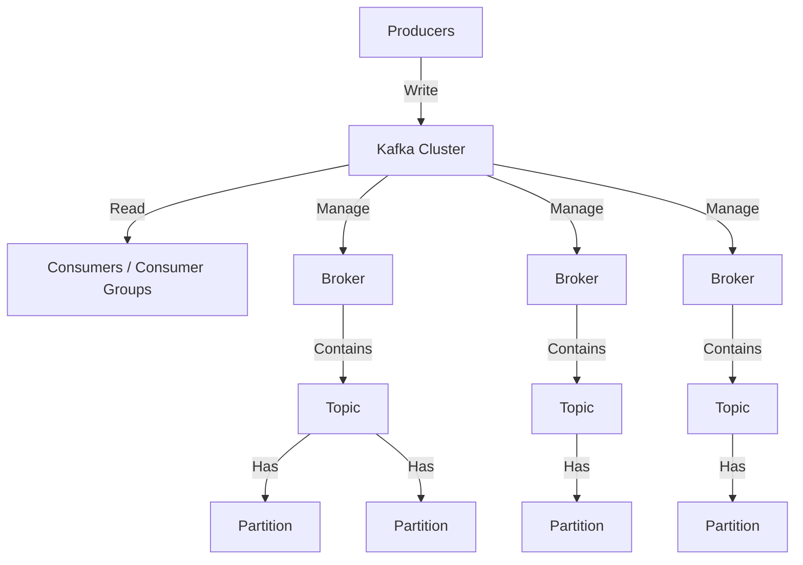

# Introduction to Kafka

## Problem Statement
As we scale in a distributed system, we often encounter problems such as:
- Handling large-scale data streams in distributed systems
- Preventing tight coupling between services to allow independent evolution
- Ensuring fault tolerance and preventing data loss

Traditional request-response communication does not scale well in these scenarios.

## Kafka Overview
Kafka is a horizontally scalable, fault-tolerant, and fast messaging system. It follows a pub-sub model where various producers and consumers can write and read messages. Kafka decouples source and target systems.

### Key Features
- Scale to 100s of nodes
- Can handle millions of messages per second
- Low latency: as low as 2ms
- High Throughput: 100s MB/s with 100Ks of messages/s

## Use Cases of Kafka
Use Kafka for:
- Real-time data streaming
- Log aggregation
- Event sourcing
- Messaging
- Batch data processing

Do NOT use Kafka for:
- Simple Request-Response Communication
- Small-Scale Projects
- High Latency Tolerance
- Monolithic Applications

> LinkedIn uses Kafka to process 1 Billion messages per day!

## Other Message Queues
- RabbitMQ: Message Queue Server in Erlang. Stores jobs in memory (message queue)
- Apache ActiveMQ: Open-source message broker in Java
- Amazon Simple Queue Service (SQS): Fully managed message queuing for microservices, distributed systems, and serverless applications

Kafka, written at LinkedIn in Scala, defaults to using persistence and uses OS disk cache for hot data, resulting in higher throughput than the above options when persistence is enabled.

## The Kafka Architecture
**Note: Kafka is moving away from its dependency on ZooKeeper and using Kafka's KRaft (Kafka Raft) mode for maintaining brokers.**

### Key Terminologies
- Producer, Consumer, Events
- Cluster, Broker
- Topic, Partitions, and Offsets

### Kafka Topic
A topic is a specific stream of data, similar to a table in a NoSQL database. Topics are split into partitions that enable distribution across various nodes. You can uniquely identify a message using its topic, partition, and offset.

Example topic names for an Ecommerce Application:
- order-placed
- order-shipped
- inventory-updated
- payment-processed

### Topic Partitions
Kafka topics are subdivided into partitions, which are the basic unit of parallelism in Kafka. Each partition is an ordered, immutable sequence of records.
- Data within a partition is assigned a unique, incremental offset to track the order of messages.
- Partitions allow for scalability, as data can be distributed across multiple brokers, enabling horizontal scaling and concurrent consumption by multiple consumers.

### Partition Offset
Offset is a unique identifier assigned to each record within a partition. Offsets are sequential integers that mark the position of a message in a partition, starting from 0.

Consumers can specify where they want to start reading by providing an offset (e.g., the most recent offset, or offset 0 to read from the beginning).

### Consuming Topics
- For a topic with multiple partitions, Kafka assigns a partition in a round-robin fashion, but users can also implement custom partitioning logic (e.g., based on a message key).
- Consumers read messages from partitions, tracking the last offset they consumed.
- Kafka does not automatically delete messages once they are consumed. It keeps messages based on a configured retention policy (e.g., 7 days or 100 GB per partition).
- Kafka provides the flexibility to reprocess messages by reading from an older offset.

## Summary
- Topics are message streams with one or more partitions.
- Partitions contain messages with unique offsets per partition.
- The Kafka cluster consists of multiple brokers managing topics and partitions.
- Producers write to topics, and consumers read from partitions.

