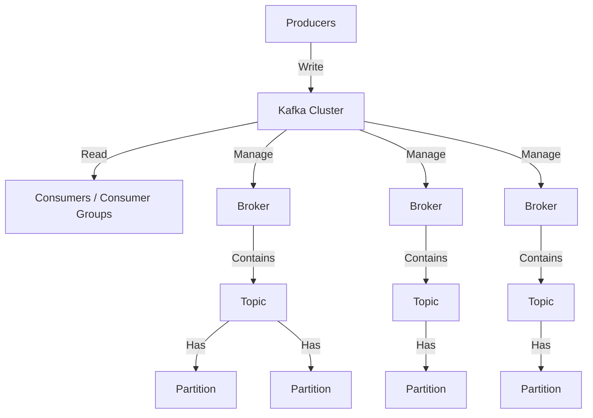
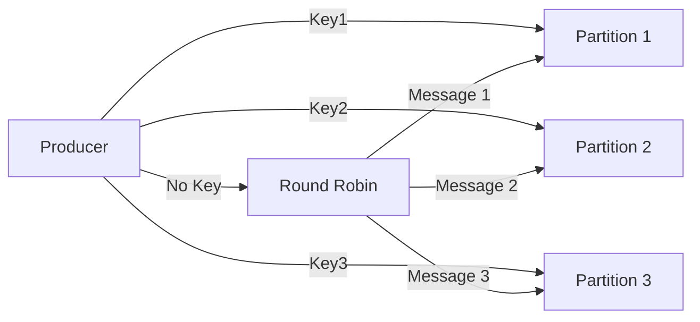
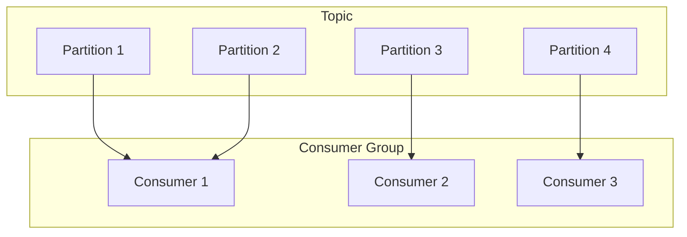
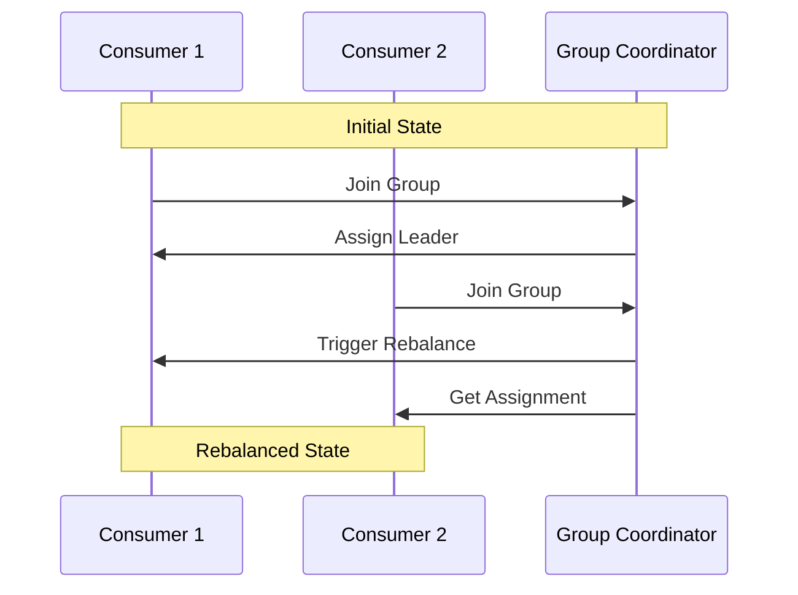
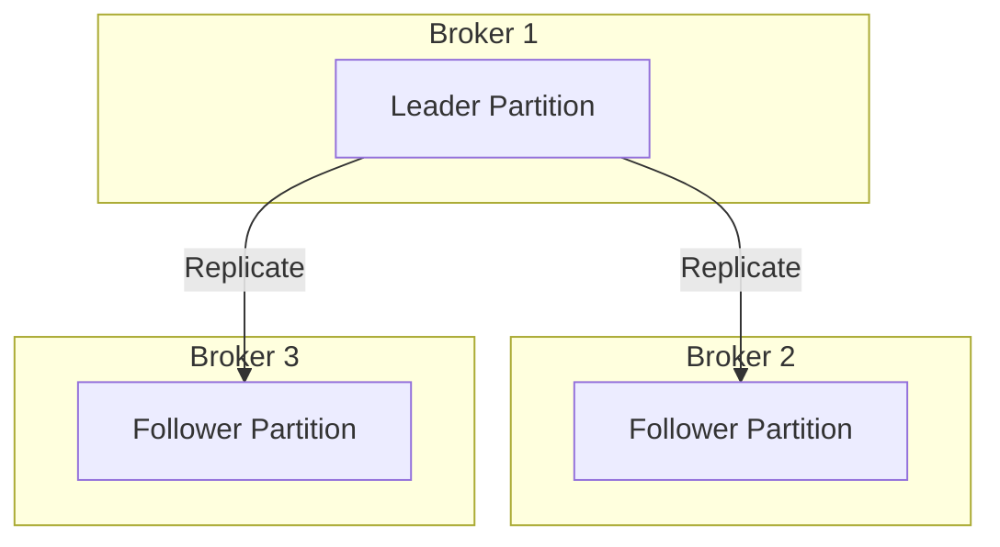
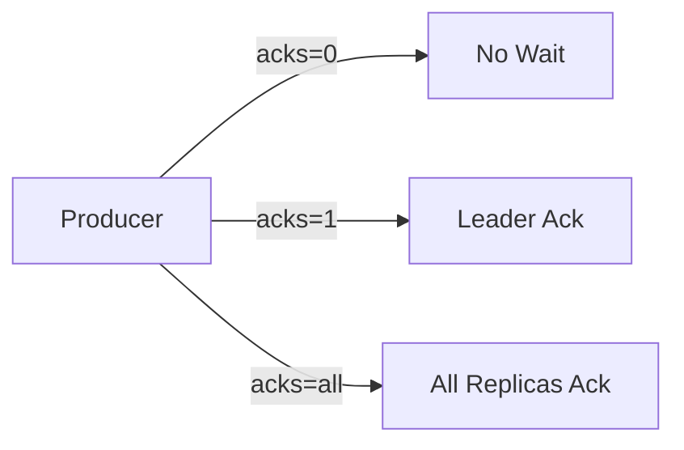

# Introduction to Kafka


# Kafka Overview

Kafka is a distributed event streaming platform originally developed by LinkedIn and later open-sourced under the Apache Software Foundation. It enables applications to publish, store, process, and subscribe to streams of records (messages) in real-time. Kafka is known for its scalability, high throughput, and fault tolerance, making it a popular choice for building event-driven architectures and real-time data pipelines.

## Core Components of Kafka:

- **Producer**:  
  Sends messages (events) to Kafka topics.

- **Broker**:  
  Kafka servers that store the messages. A Kafka cluster can have multiple brokers for fault tolerance and scalability.

- **Topic**:  
  A logical category to which events are sent by producers. Each topic can have multiple partitions.

- **Partition**:  
  A way to split a topic into smaller parts for parallel processing.

- **Consumer**:  
  Reads messages from a topic. Consumers can work independently or as part of consumer groups.

- **Zookeeper (or KRaft in newer versions)**:  
  Coordinates the Kafka brokers and manages cluster metadata. Kafka is transitioning to KRaft mode, removing the dependency on Zookeeper.

## Why Use Kafka?

- **High Throughput and Low Latency**:  
  Kafka can handle millions of events per second with very low latency, making it suitable for real-time applications.

- **Scalability**:  
  Kafka allows you to add brokers dynamically to the cluster, distributing data across brokers and partitions to handle increasing loads.

- **Fault Tolerance**:  
  Kafka stores data replicas across multiple brokers, ensuring data availability even if some brokers fail.

- **Durability**:  
  Kafka stores data on disk for a configurable retention period. This ensures that even if consumers are offline, they can catch up later.

- **Decoupling**:  
  Kafka allows producers and consumers to be loosely coupled. Producers send data without needing to know how or when it will be consumed.

## Common Use Cases of Kafka:

- **Event Streaming**:  
  Real-time analytics, fraud detection, user activity tracking.

- **Log Aggregation**:  
  Collecting and centralizing logs from various services for monitoring and analysis.

- **Data Pipelines**:  
  Integrating different data sources and syncing them with data warehouses or databases.

- **Messaging System**:  
  Kafka serves as a reliable messaging system between microservices or distributed components.

- **IoT Data Processing**:  
  Collecting and processing data streams from IoT devices and sensors.

- **Real-Time Applications**:  
  Chat applications, stock market feeds, and video streaming platforms.

## Summary

Kafka is a distributed, scalable, and fault-tolerant platform used for building real-time event pipelines and streaming applications. Its high throughput, durability, and flexibility make it ideal for applications that require real-time data processing and event-driven architecture.


## Problem Statement
As we scale in a distributed system, we often encounter problems such as:
- Handling large-scale data streams in distributed systems
- Preventing tight coupling between services to allow independent evolution
- Ensuring fault tolerance and preventing data loss

Traditional request-response communication does not scale well in these scenarios.

## Kafka Overview
Kafka is a horizontally scalable, fault-tolerant, and fast messaging system. It follows a pub-sub model where various producers and consumers can write and read messages. Kafka decouples source and target systems.

### Key Features
- Scale to 100s of nodes
- Can handle millions of messages per second
- Low latency: as low as 2ms
- High Throughput: 100s MB/s with 100Ks of messages/s

## Use Cases of Kafka
Use Kafka for:
- Real-time data streaming
- Log aggregation
- Event sourcing
- Messaging
- Batch data processing

Do NOT use Kafka for:
- Simple Request-Response Communication
- Small-Scale Projects
- High Latency Tolerance
- Monolithic Applications

> LinkedIn uses Kafka to process 1 Billion messages per day!

## Other Message Queues
- RabbitMQ: Message Queue Server in Erlang. Stores jobs in memory (message queue)
- Apache ActiveMQ: Open-source message broker in Java
- Amazon Simple Queue Service (SQS): Fully managed message queuing for microservices, distributed systems, and serverless applications

Kafka, written at LinkedIn in Scala, defaults to using persistence and uses OS disk cache for hot data, resulting in higher throughput than the above options when persistence is enabled.

## The Kafka Architecture
**Note: Kafka is moving away from its dependency on ZooKeeper and using Kafka's KRaft (Kafka Raft) mode for maintaining brokers.**

### Key Terminologies
- Producer, Consumer, Events
- Cluster, Broker
- Topic, Partitions, and Offsets



### Kafka Topic
A topic is a specific stream of data, similar to a table in a NoSQL database. Topics are split into partitions that enable distribution across various nodes. You can uniquely identify a message using its topic, partition, and offset.

Example topic names for an Ecommerce Application:
- order-placed
- order-shipped
- inventory-updated
- payment-processed

### Topic Partitions
Kafka topics are subdivided into partitions, which are the basic unit of parallelism in Kafka. Each partition is an ordered, immutable sequence of records.
- Data within a partition is assigned a unique, incremental offset to track the order of messages.
- Partitions allow for scalability, as data can be distributed across multiple brokers, enabling horizontal scaling and concurrent consumption by multiple consumers.

### Partition Offset
Offset is a unique identifier assigned to each record within a partition. Offsets are sequential integers that mark the position of a message in a partition, starting from 0.

Consumers can specify where they want to start reading by providing an offset (e.g., the most recent offset, or offset 0 to read from the beginning).

### Consuming Topics
- For a topic with multiple partitions, Kafka assigns a partition in a round-robin fashion, but users can also implement custom partitioning logic (e.g., based on a message key).
- Consumers read messages from partitions, tracking the last offset they consumed.
- Kafka does not automatically delete messages once they are consumed. It keeps messages based on a configured retention policy (e.g., 7 days or 100 GB per partition).
- Kafka provides the flexibility to reprocess messages by reading from an older offset.

## Summary
- Topics are message streams with one or more partitions.
- Partitions contain messages with unique offsets per partition.
- The Kafka cluster consists of multiple brokers managing topics and partitions.
- Producers write to topics, and consumers read from partitions.

# Apache Kafka Architecture

## Key Questions Addressed
1. How does the Partitioning of Topics take place?
2. How does Kafka ensure message ordering?
3. Can the consumers read the same message again and again?
4. What happens when new Consumers are added to the system?
5. What happens when some brokers go down?
6. Can consumer read the messages after a few days they are produced?

## Partitioning Logic
- Producers can use partition keys to direct messages to specific partitions
- Partition keys can be any value (e.g., device ID, user ID)
- Without partition key, Kafka uses round-robin partition assignment
- Messages with same key always go to same partition
- Order guaranteed only for messages with same partition key



## Reading Records from Partitions
- Kafka uses pull-based approach (consumers pull messages)
- Consumers track offset of last consumed message
- Enables resuming from specific points after crashes
- Consumer Groups manage message distribution

## Consumer Groups


Key Points:
- Each message read by only one consumer in a group
- Each partition consumed by exactly one consumer
- Maximum parallelism = number of partitions
- Parallelism not governed by number of consumers

## Rebalancing
Occurs when:
- New consumer joins group
- Existing consumer fails
- New partitions added
- Consumer deemed dead by Group coordinator

First consumer becomes Group Leader



## Partition Replication


- Creates partition copies across brokers
- Enables fault tolerance
- One partition elected as leader
- Others become followers

## Kafka Brokers Management
- Uses Raft consensus protocol
- KRaft mode enables direct broker coordination
- Eliminates ZooKeeper dependency
- Brokers elect leader and replicate state

## Log Retention
- Controls message storage duration
- Based on:
  - Time (retention.ms)
  - Size (retention.bytes)
- Can retain indefinitely (retention.ms=-1)
- Old messages deleted automatically

## Acknowledgments (acks) and Retries

### Acks Levels


1. acks=0
  - No acknowledgment
  - Fastest but no guarantees

2. acks=1
  - Leader acknowledgment only

3. acks=all (-1)
  - All in-sync replicas acknowledge
  - Highest durability

### Retries
- Automatic retry on failed sends
- Configurable retry count
- Helps handle:
  - Network issues
  - Broker failures
- Works with acks=all for maximum reliability

## Summary of Key Concepts
1. Topics divided into partitions for scalability
2. Consumer groups ensure efficient message distribution
3. Replication provides fault tolerance
4. KRaft manages broker coordination
5. Configurable retention policies
6. Flexible acknowledgment levels for reliability

# Kafka and Kafbat UI Installation Guide (Windows)

## Prerequisites
1. Java JDK (version 8 or higher)
2. Windows operating system
3. Command prompt or PowerShell

## Kafka Installation Steps

### 1. Download Apache Kafka
- Visit the [Apache Kafka downloads page](https://kafka.apache.org/downloads)
- Download the latest binary version
- Extract the downloaded file to a location (e.g., `C:\kafka`)

### 2. Configure Kafka
1. Navigate to the Kafka directory
2. Open `config/kraft/server.properties`
3. Verify/update these configurations:
   ```properties
   listeners=PLAINTEXT://localhost:9092
   log.dirs=/tmp/kafka-logs
   ```

### 3. Initialize Kafka Cluster
First, generate a cluster UUID:
```powershell
$KAFKA_CLUSTER_ID = (.\bin\windows\kafka-storage.bat random-uuid)
```

To verify the generated UUID:
```powershell
echo $KAFKA_CLUSTER_ID
```

Format the log directories:
```powershell
.\bin\windows\kafka-storage.bat format -t $KAFKA_CLUSTER_ID -c .\config\kraft\server.properties
```

### 4. Start Kafka Server
```powershell
.\bin\windows\kafka-server-start.bat .\config\kraft\server.properties
```

## Kafka Basic Commands

### Create a Topic
```powershell
.\bin\windows\kafka-topics.bat --create --topic ashish --bootstrap-server localhost:9092
```

### Describe a Topic
```powershell
.\bin\windows\kafka-topics.bat --describe --topic ashish --bootstrap-server localhost:9092
```

### Write to a Topic (Producer)
```powershell
.\bin\windows\kafka-console-producer.bat --topic ashish --bootstrap-server localhost:9092
```
After executing this command, you can type messages and press Enter to send them.

### Read from a Topic (Consumer)
```powershell
.\bin\windows\kafka-console-consumer.bat --topic ashish --from-beginning --bootstrap-server localhost:9092
```

## Kafbat UI Installation

### 1. Download Kafbat UI
- Visit the [Kafbat UI releases page](https://github.com/kafbat/kafka-ui/releases)
- Download the latest version of `kafbat-ui-v1.0.0.jar`

### 2. Create Configuration File
Create `application.yml` in the same directory as the JAR file:
```yaml
kafka:
  clusters:
    - name: local
      bootstrapServers: localhost:9092
      metrics:
        port: 9997
      schemaRegistry: http://localhost:8081

server:
  port: 8080
```

### 3. Start Kafbat UI
```powershell
java -Dspring.config.additional-location=application.yml --add-opens java.rmi/javax.rmi.ssl=ALL-UNNAMED -jar kafbat-ui-v1.0.0.jar
```

Access the UI at: `http://localhost:8080`

## Directory Structure
```
C:\kafka\
├── bin\
│   └── windows\
├── config\
│   └── kraft\
│       └── server.properties
├── libs\
├── logs\
├── kafbat-ui-v1.0.0.jar
└── application.yml
```

## Troubleshooting Tips

1. **Port Already in Use**
  - Check if ports 9092 or 8080 are already in use
  - Use `netstat -ano | findstr :9092` to check port usage
  - Kill process using: `taskkill /PID [process-id] /F`

2. **Kafka Won't Start**
  - Ensure JAVA_HOME is set correctly
  - Check logs in `logs` directory
  - Verify cluster ID is correctly set

3. **Kafbat UI Connection Issues**
  - Verify Kafka is running
  - Check application.yml configuration
  - Ensure all required ports are available

## Common Operations

### List All Topics
```powershell
.\bin\windows\kafka-topics.bat --list --bootstrap-server localhost:9092
```

### Delete a Topic
```powershell
.\bin\windows\kafka-topics.bat --delete --topic ashish --bootstrap-server localhost:9092
```

### Create Multi-partition Topic
```powershell
.\bin\windows\kafka-topics.bat --create --topic multi-part --partitions 3 --bootstrap-server localhost:9092
```

### Consumer Group List
```powershell
.\bin\windows\kafka-consumer-groups.bat --list --bootstrap-server localhost:9092
```

## Important Notes

1. **Path Considerations**
  - Use full paths if commands don't work with relative paths
  - Avoid spaces in installation directory paths

2. **Security**
  - Default setup has no security enabled
  - For production, configure appropriate security measures

3. **Memory Settings**
  - Default memory settings are for development
  - Adjust heap sizes for production use

4. **Persistence**
  - Log directory location is important for data persistence
  - Backup log.dirs location for data recovery