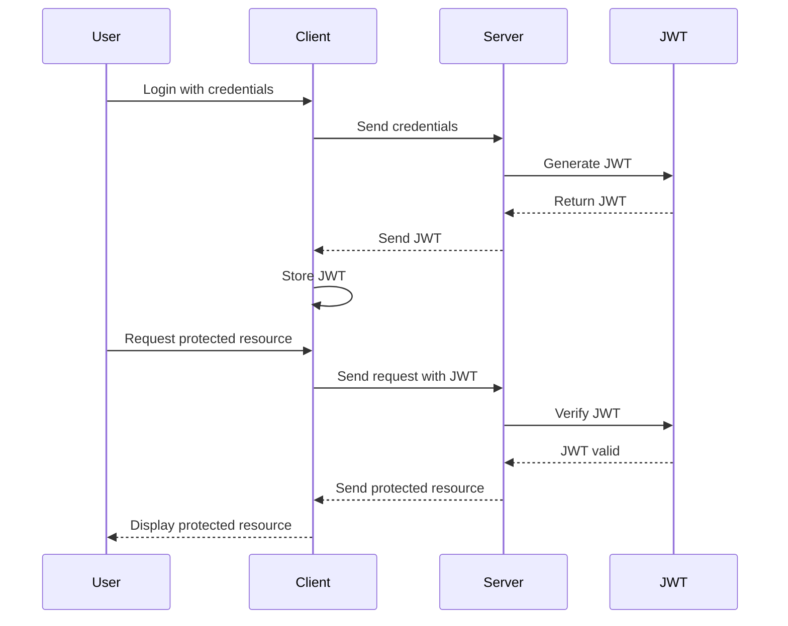
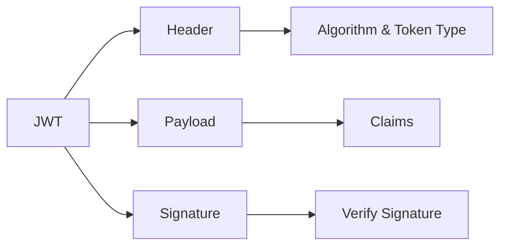
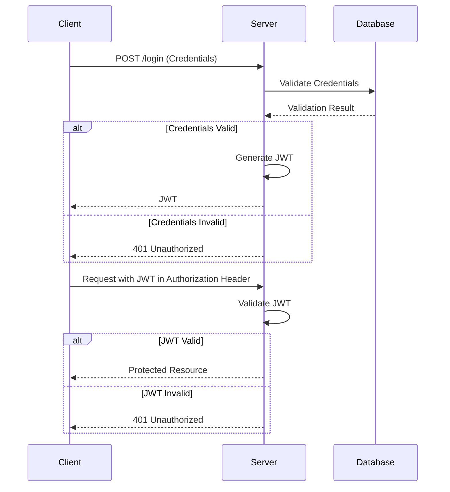
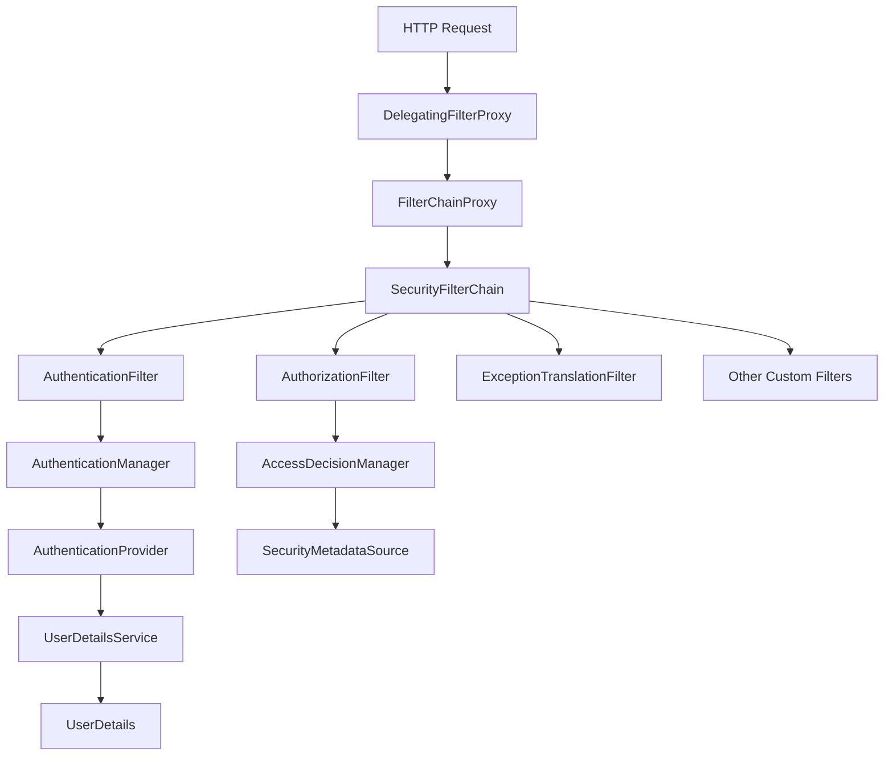
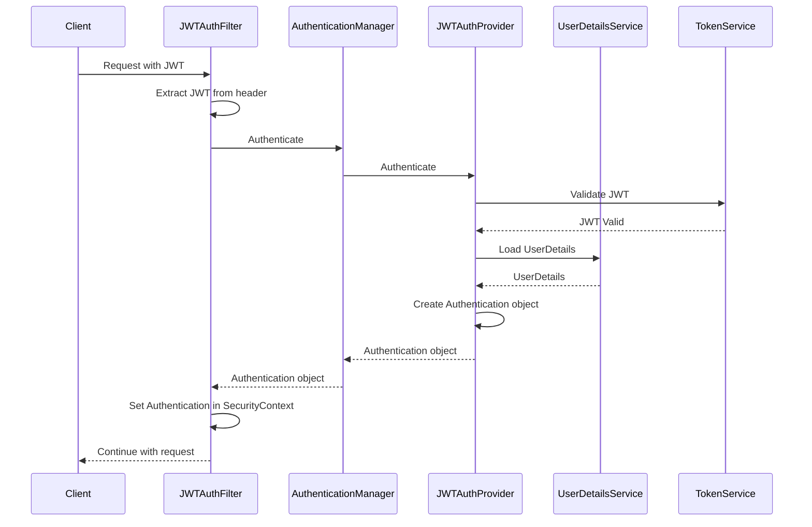
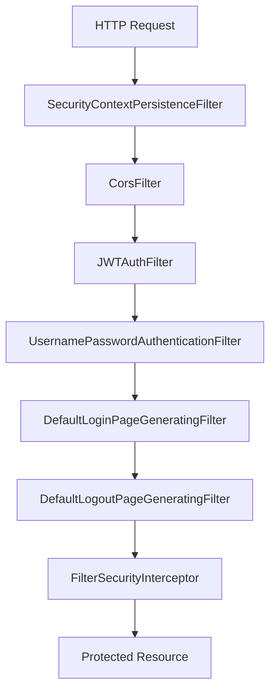
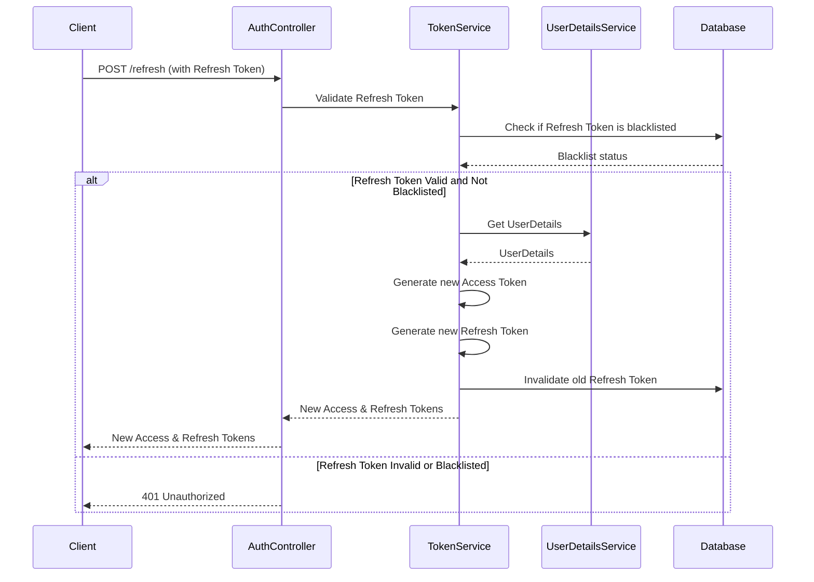
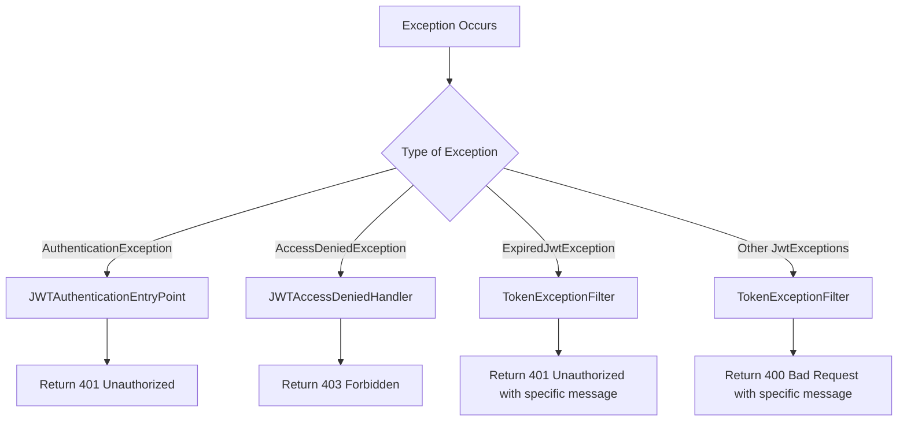

# Understanding JWT - Spring Security

## Why use JSON Web Token (JWT)

1. Stateless
2. Scalable in Distributed Systems
3. Cross domain authentication
4. Ideal for Decentralized systems and microservices
5. Highly secure

## JSON Web Token (JWT)

JWT is a compact, URL-safe means of representing claims to be transferred between two parties.

JWT is often used to transmit non-sensitive data that doesn't require confidentiality but still needs integrity and authenticity. This includes user identifiers, roles, permissions, and other claims necessary for making access control decisions.

## JWT Creation

Sample Token:
```
eyJhbGciOiJIUzI1NiJ9.eyJzdWIiOiI0NSIsI
nJvbGVzIjpbIlJJREVSIl0sImlhdCI6MTcy
MTU2NzUxOSwiZXhwIjoxNzIxNTgxOTE
5fQ.pIEiLEboraXMhJrm8ckRLpoYSWC6n
9mY3XNlCpLFE4I
```

## JWT Verification

Sample Token:
```
eyJhbGciOiJIUzI1NiJ9.eyJzdWIiOiI0NSIsI
nJvbGVzIjpbIlJJREVSIl0sImlhdCI6MTcy
MTU2NzUxOSwiZXhwIjoxNzIxNTgxOTE
5fQ.pIEiLEboraXMhJrm8ckRLpoYSWC6n
9mY3XNlCpLFE4I
```

## Using JWT For Authentication



## JWT Dependencies

For a Spring Security project using JWT, you typically need the following dependencies:

1. **Spring Security**
   ```xml
   <dependency>
       <groupId>org.springframework.boot</groupId>
       <artifactId>spring-boot-starter-security</artifactId>
   </dependency>
   ```

2. **JSON Web Token Support**
   ```xml
   <dependency>
       <groupId>io.jsonwebtoken</groupId>
       <artifactId>jjwt-api</artifactId>
       <version>0.11.5</version>
   </dependency>
   <dependency>
       <groupId>io.jsonwebtoken</groupId>
       <artifactId>jjwt-impl</artifactId>
       <version>0.11.5</version>
       <scope>runtime</scope>
   </dependency>
   <dependency>
       <groupId>io.jsonwebtoken</groupId>
       <artifactId>jjwt-jackson</artifactId>
       <version>0.11.5</version>
       <scope>runtime</scope>
   </dependency>
   ```

3. **Spring Web (if not already included)**
   ```xml
   <dependency>
       <groupId>org.springframework.boot</groupId>
       <artifactId>spring-boot-starter-web</artifactId>
   </dependency>
   ```


# JWT Authentication in Spring Security: An Advanced Guide

## Table of Contents
1. [Introduction](#introduction)
2. [JWT Structure and Flow](#jwt-structure-and-flow)
3. [Spring Security Architecture](#spring-security-architecture)
4. [Detailed Authentication Flow](#detailed-authentication-flow)
5. [JWT Filter Chain](#jwt-filter-chain)
6. [Refresh Token Mechanism](#refresh-token-mechanism)
7. [Exception Handling and Security](#exception-handling-and-security)
8. [Best Practices and Considerations](#best-practices-and-considerations)

## Introduction

This advanced guide dives deep into the implementation of JWT (JSON Web Token) authentication in Spring Security. We'll explore the intricate details of the authentication process, the Spring Security architecture, and advanced concepts like refresh token mechanisms.

## JWT Structure and Flow

Before we delve into the implementation details, let's review the structure of a JWT and its basic flow.

### JWT Structure

A JWT consists of three parts: Header, Payload, and Signature.



1. **Header**: Contains the type of token and hashing algorithm.
2. **Payload**: Contains claims (statements about the user and additional metadata).
3. **Signature**: Ensures the token hasn't been altered.

### Basic JWT Flow



## Spring Security Architecture

Spring Security provides a flexible and powerful architecture for handling authentication and authorization.



1. **DelegatingFilterProxy**: The entry point for Spring Security in the web application.
2. **FilterChainProxy**: Manages the security filter chain.
3. **SecurityFilterChain**: Contains the ordered list of security filters.
4. **AuthenticationFilter**: Handles the authentication process.
5. **AuthorizationFilter**: Handles the authorization process.
6. **ExceptionTranslationFilter**: Translates Spring Security exceptions into HTTP responses.
7. **AuthenticationManager**: Processes authentication requests.
8. **AuthenticationProvider**: Performs the actual authentication.
9. **UserDetailsService**: Loads user-specific data.
10. **AccessDecisionManager**: Makes access control decisions.

## Detailed Authentication Flow

Let's break down the authentication process in detail:



1. The client sends a request with the JWT in the Authorization header.
2. `JWTAuthFilter` extracts the JWT from the header.
3. The filter passes the token to the `AuthenticationManager`.
4. `AuthenticationManager` delegates to `JWTAuthProvider`.
5. `JWTAuthProvider` uses `TokenService` to validate the JWT.
6. If valid, `UserDetailsService` loads the user details.
7. `JWTAuthProvider` creates an `Authentication` object.
8. The `Authentication` object is set in the `SecurityContext`.
9. The request continues to the protected resource.

## JWT Filter Chain

The JWT filter chain is crucial for integrating JWT authentication into Spring Security:



1. **SecurityContextPersistenceFilter**: Restores the `SecurityContext` from a session.
2. **CorsFilter**: Handles Cross-Origin Resource Sharing.
3. **JWTAuthFilter**: Custom filter for JWT authentication.
4. **UsernamePasswordAuthenticationFilter**: Processes login requests.
5. **DefaultLoginPageGeneratingFilter**: Generates a default login page if needed.
6. **DefaultLogoutPageGeneratingFilter**: Generates a default logout page if needed.
7. **FilterSecurityInterceptor**: Makes final access control decisions.

## Refresh Token Mechanism

Implementing a refresh token mechanism enhances security and user experience:



1. The client sends a refresh request with the current refresh token.
2. `AuthController` asks `TokenService` to validate the refresh token.
3. `TokenService` checks if the refresh token is blacklisted.
4. If valid and not blacklisted, `UserDetailsService` loads the user details.
5. `TokenService` generates new access and refresh tokens.
6. The old refresh token is invalidated in the database.
7. New tokens are sent back to the client.

## Exception Handling and Security

Proper exception handling is crucial for maintaining security:



- **JWTAuthenticationEntryPoint**: Handles authentication failures.
- **JWTAccessDeniedHandler**: Handles authorization failures.
- **TokenExceptionFilter**: Catches and handles JWT-specific exceptions.

## Best Practices and Considerations

1. **Token Storage**: Store tokens securely (e.g., HttpOnly cookies for refresh tokens).
2. **Token Expiration**: Use short-lived access tokens and longer-lived refresh tokens.
3. **Token Revocation**: Implement a token blacklist for immediate revocation.
4. **Signature Algorithm**: Use strong algorithms like RS256 (RSA Signature with SHA-256).
5. **Payload Content**: Minimize sensitive data in the JWT payload.
6. **HTTPS**: Always use HTTPS to prevent token interception.
7. **Rate Limiting**: Implement rate limiting on token endpoints to prevent abuse.
8. **Monitoring**: Log and monitor authentication activities for suspicious patterns.

By implementing these advanced concepts and following best practices, you can create a robust, secure, and scalable JWT authentication system using Spring Security.