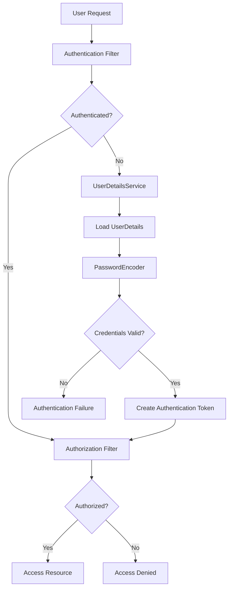

# Security Attacks

## Cross-Site Request Forgery (CSRF)

Cross-Site Request Forgery (CSRF) is an attack that tricks a user into performing actions on a web application in which they are authenticated, without their consent. This is achieved by exploiting the web application's trust in the user's browser. For example, if a banking site doesn't protect against CSRF, an attacker could trick a logged-in user into making a bank transfer without their knowledge.


### How to avoid:

1. Maintain user session on server with the xcsrf token. This token should be very unpredictable.
2. Go STATELESS and manage authentication with the JWT token.

## Cross-Site Scripting (XSS)

Cross-Site Scripting (XSS) is a type of security vulnerability typically found in web applications. XSS attacks occur when an attacker is able to inject malicious scripts into web pages viewed by other users. These scripts can steal user data, hijack user sessions, deface websites, or perform other malicious actions.

For example, this script could be stored by a user as comments:

```html
<script>alert('XSS');</script>
```

### How to avoid:

1. Input Validation: Validate and sanitize all user inputs to ensure they do not contain malicious code. Use frameworks or libraries that automatically handle input validation.
2. Output Encoding: Encode all outputs to ensure that any potentially dangerous characters are rendered harmless in the browser. This prevents injected scripts from being executed.

   ```java
   HtmlUtils.htmlEscape(userInput);
   ```

## SQL Injection

SQL Injection is a type of attack that allows attackers to execute arbitrary SQL queries on a database by injecting malicious SQL code into an application's input fields. The attacker manipulates this input to include SQL code that changes the intended query, often to retrieve or manipulate data in unauthorized ways.

Server query:
```sql
SELECT * FROM users WHERE username = 'input';
```

Attacker input:
```
' OR '1'='1
```

Resulting query:
```sql
SELECT * FROM users WHERE username = '' OR '1'='1';
```


### How to avoid:

- Use prepared statements and parameterized queries.
- Employ ORM frameworks that abstract direct SQL queries.
- Validate and sanitize inputs.

# Internal Working of Spring Security

## Adding Spring Security

In a Spring Boot application, we only need to include the `spring-boot-starter-security` dependency, and Spring Boot auto-configures the security with sensible defaults defined in the `WebSecurityConfiguration` class.

```xml
<dependency>
    <groupId>org.springframework.boot</groupId>
    <artifactId>spring-boot-starter-security</artifactId>
</dependency>
```

## Authentication and Authorization

### Authentication
Authentication is the process of verifying the identity of a user. It ensures that the user is who they claim to be. Authentication typically involves validating credentials, such as a username and password, and creating a security context for the user.

### Authorization
Authorization is the process of determining whether an authenticated user has the necessary permissions to access a particular resource or perform an action. It controls what an authenticated user can or cannot do.

## Internal Working of Spring Security

1. In a Spring Boot application, `SecurityFilterAutoConfiguration` automatically registers the `DelegatingFilterProxy` filter with the name `springSecurityFilterChain`.

2. Once the request reaches the `DelegatingFilterProxy`, Spring delegates the processing to the `FilterChainProxy` bean.

3. The `FilterChainProxy` utilizes the `SecurityFilterChain` to execute the list of all filters to be invoked for the current request.

## Default Behavior of Spring Security

- Creates a bean named `springSecurityFilterChain`.
- Registers the Filter with a bean named `springSecurityFilterChain` with the Servlet container for every request.
- Implements HTTP basic authentication for authenticating requests made with remoting protocols and web services.
- Generates a default login form.
- Creates a user with a username of "user" and a password that is logged to the console.
- Protects the password storage with BCrypt.
- Enables logout feature.
- Implements other features such as protection from CSRF attacks and session fixation.

## Internal Flow of Spring Security

Here's a simple diagram illustrating the internal flow of Spring Security:

```
   HTTP Request
        |
        v
+-------------------+
| DelegatingFilter  |
|      Proxy        |
+-------------------+
        |
        v
+-------------------+
|  FilterChainProxy |
+-------------------+
        |
        v
+-------------------+
| SecurityFilterChain|
+-------------------+
        |
        v
+-------------------+
|  Security Filters  |
| ---------------    |
| - Authentication   |
| - Authorization    |
| - Session Mgmt     |
| - CSRF Protection  |
| - etc.             |
+-------------------+
        |
        v
   Protected Resource
```

This diagram shows how an HTTP request passes through the various components of Spring Security:

1. The request first hits the `DelegatingFilterProxy`.
2. It's then passed to the `FilterChainProxy`.
3. The `FilterChainProxy` uses the `SecurityFilterChain` to determine which security filters to apply.
4. The request passes through various security filters for authentication, authorization, session management, CSRF protection, etc.
5. If all security checks pass, the request finally reaches the protected resource.

This flow ensures that every request is properly secured before reaching the actual application resources.


# Core Spring Security Components

## 1. UserDetails

- Interface representing a user in Spring Security
- Provides methods to get user information (username, password, authorities)
- Purpose: Encapsulate user information, including authentication and authorization details
- Implementation: Can be used to extend your User Entity

## 2. UserDetailsService

- Core interface for retrieving user-related data
- Single method: `loadUserByUsername`
- Purpose: Fetch user details from a datasource (e.g., database) based on the username
- Implementation: Typically implemented to load user details from your own user repository

## 3. InMemoryUserDetailsManager

- Spring Security provided implementation of UserDetailsService
- Stores user information in memory
- Purpose: Store user details in memory, typically for testing or small applications
- Users are defined directly in the configuration

## 4. PasswordEncoder

- Interface for encoding and validating passwords
- Methods for encoding raw passwords and matching encoded passwords
- Purpose: Securely hash passwords before storing and verify hashed passwords during authentication
- Common Implementations:
   - BCryptPasswordEncoder
   - Pbkdf2PasswordEncoder
   - SCryptPasswordEncoder

## Internal Flow of Spring Security

Below is a simplified diagram representing the internal flow of Spring Security:



This diagram illustrates:

1. The user sends a request.
2. The request goes through the Authentication Filter.
3. If not authenticated, UserDetailsService loads the user details.
4. PasswordEncoder verifies the credentials.
5. If valid, an Authentication Token is created.
6. The request then goes through the Authorization Filter.
7. If authorized, access to the resource is granted.
8. If not authorized at any stage, access is denied.

Note: This is a simplified representation. The actual flow in Spring Security can be more complex depending on the configuration and specific use case.


### Creating User Roles

You can define user roles and configure access based on these roles:

```java
@Configuration
@EnableWebSecurity
public class SecurityConfig extends WebSecurityConfigurerAdapter {

    @Override
    protected void configure(HttpSecurity http) throws Exception {
        http
            .authorizeRequests()
                .antMatchers("/admin/**").hasRole("ADMIN")
                .antMatchers("/user/**").hasAnyRole("USER", "ADMIN")
                .anyRequest().authenticated()
                .and()
            .formLogin();
    }

    @Override
    protected void configure(AuthenticationManagerBuilder auth) throws Exception {
        auth.inMemoryAuthentication()
            .withUser("user").password("{noop}password").roles("USER")
            .and()
            .withUser("admin").password("{noop}password").roles("ADMIN");
    }
}
```

This configuration:
- Restricts `/admin/**` paths to users with ADMIN role
- Allows both USER and ADMIN roles to access `/user/**` paths
- Creates two in-memory users with different roles

### Disabling Form Login

To disable form login and use HTTP Basic authentication instead:

```java
http
    .httpBasic()
    .and()
    .formLogin().disable();
```

### Disabling Sessions

To make your application stateless (useful for REST APIs):

```java
http
    .sessionManagement()
    .sessionCreationPolicy(SessionCreationPolicy.STATELESS);
```

This configuration ensures that no session is created or used by Spring Security.

### Disabling CSRF Protection

While generally not recommended, you can disable CSRF protection if needed (e.g., for stateless REST APIs):

```java
http
    .csrf().disable();
```

### Comprehensive Example

Here's a more comprehensive example incorporating these configurations:

```java
@Configuration
@EnableWebSecurity
public class SecurityConfig extends WebSecurityConfigurerAdapter {

    @Override
    protected void configure(HttpSecurity http) throws Exception {
        http
            .authorizeRequests()
                .antMatchers("/public/**").permitAll()
                .antMatchers("/api/**").authenticated()
                .and()
            .httpBasic()
            .and()
            .sessionManagement().sessionCreationPolicy(SessionCreationPolicy.STATELESS)
            .and()
            .csrf().disable()
            .formLogin().disable();
    }

    @Override
    protected void configure(AuthenticationManagerBuilder auth) throws Exception {
        auth.inMemoryAuthentication()
            .withUser("user").password("{noop}password").roles("USER")
            .and()
            .withUser("admin").password("{noop}password").roles("ADMIN");
    }
}
```

This configuration:
- Allows public access to `/public/**` paths
- Requires authentication for `/api/**` paths
- Uses HTTP Basic authentication
- Disables session creation (stateless)
- Disables CSRF protection
- Disables form login
- Sets up in-memory authentication with two users

Remember, these configurations should be adapted based on your specific security requirements. Always consider the security implications of disabling features like CSRF protection or sessions.